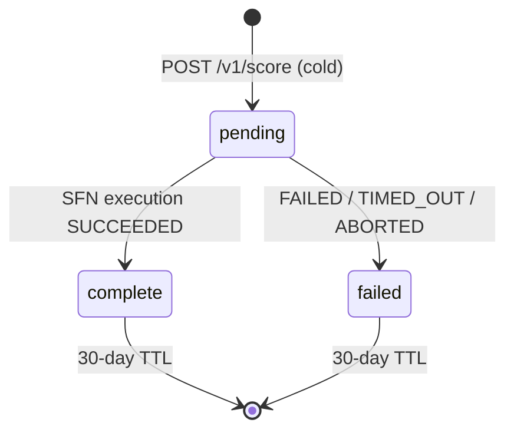

Cold scoring is always async. When [`POST /v1/score`](/endpoints/score) cannot serve a cached record within your tier's freshness window, the server returns `202 Accepted` with a `job_id` and continues the scoring run in the background. Poll [`GET /v1/jobs/{job_id}`](/endpoints/jobs) until the job settles.

This page covers the **manual polling** workflow. The official SDKs handle polling for you — see [`POST /v1/score`](/endpoints/score) for the SDK examples.

## Eligibility

Auto-queue applies to all paid tiers (Starter, Growth, Scale, Enterprise). Free tier cannot run live cold paths at all and receives:

```
HTTP/1.1 403 Forbidden
{ "error": "free_tier_sandbox_only", "tier": "free" }
```

## When you'll get a 202

- `POST /v1/score` for a domain you've never asked for.
- `POST /v1/score` for a domain whose most-recent stored record is older than your tier's freshness window (see [Tiers](/tiers)).
- `POST /v1/score` with `force_fresh: true` on Enterprise (bypasses cache deliberately).

You will *not* get a 202 when:
- The cached record is fresh for your tier → 200 with the score inline.
- You hit your monthly cold-call cap → 429 `cold_budget_exhausted`.
- You hit the per-key 1h ceiling (200 cold) or account 24h breaker → 429.

## Response shape

```
HTTP/1.1 202 Accepted
{
  "job_id":   "9f0c2d83-bf1e-4d18-a7d6-1ab2c3d4e5f6",
  "status":   "pending",
  "domain":   "stripe.com",
  "poll_url": "/v1/jobs/9f0c2d83-bf1e-4d18-a7d6-1ab2c3d4e5f6"
}
```

The 202 typically arrives in under 1 second — it's just the time to start the Step Functions execution and write the job row.

## Poll until settled

```python
import requests, time

def wait_for_score(job_id, key, *, timeout=180):
    deadline = time.time() + timeout
    while time.time() < deadline:
        r = requests.get(f"https://api.keplerinsights.us/v1/jobs/{job_id}",
                         headers={"X-API-Key": key})
        r.raise_for_status()
        job = r.json()
        if job["status"] == "complete":
            return job["result_ref"]              # {domain, scored_at}
        if job["status"] == "failed":
            raise RuntimeError(job.get("failure_reason"))
        time.sleep(5)
    raise TimeoutError(f"job {job_id} did not settle")
```

Recommended poll cadence: every 5 seconds, up to 180 seconds total. Cold runs typically complete in 25–90 seconds.

Once the job returns `status: complete`, fetch the score directly:

```bash
curl https://api.keplerinsights.us/v1/score/stripe.com \
  -H "X-API-Key: ki_live_..."
```

## What auto-queue does not change

- **Cost.** Cold-call usage and cost-log writes happen at job start. The fetcher pipeline runs whether you poll or not. Cap rules and per-account circuit breakers apply identically.
- **Freshness check.** The cached-fresh short-circuit happens *before* a job is created, so you never pay for a redundant cold run by routing through `POST /v1/score`.
- **Sandbox.** `ki_test_` keys against the 4 canned test domains always return 200 inline — sandbox has no real cold path.

## Job lifecycle



## Migration note (pre-2026-05-12)

Before 2026-05-12, `POST /v1/score` blocked synchronously for up to 60 seconds on cold paths. This was incompatible with HTTP API's 30-second integration timeout — cold requests would intermittently return 503 from the gateway while the scoring engine continued running server-side. Auto-queue resolves this. The `wait=false` parameter is still accepted for backwards compatibility but is now a no-op — cold is always async, sync `wait=true` requests get the same 202 response shape.
