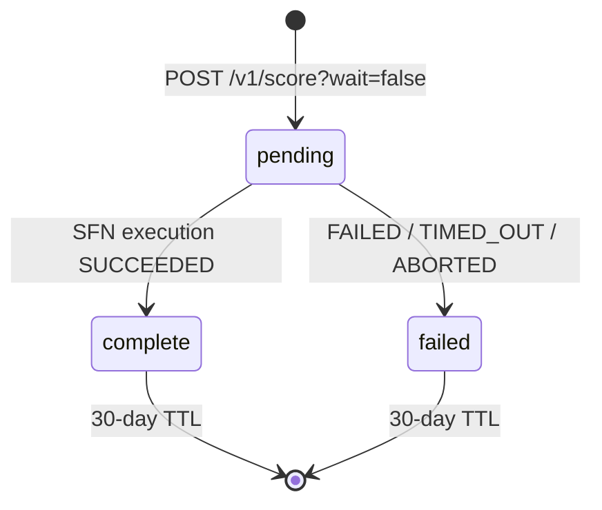

`POST /v1/score?wait=false` returns immediately with a `job_id` instead of blocking up to 60 seconds. Poll `GET /v1/jobs/{job_id}` until `status: complete`, then read the score from `/v1/score/{domain}`.

## Eligibility

Async is available on **Growth, Scale, and Enterprise** tiers. Free and Starter receive:

```
HTTP/1.1 400 Bad Request
{ "error": "async_requires_growth", "tier": "starter" }
```

## When to use it

- Your request is user-facing and you can't justify a 60-second blocking call.
- You're scoring many companies in a batch and want concurrency without holding HTTP connections open.
- You're behind a proxy or load balancer with a request timeout shorter than 60s.

## Start a job

```bash
curl -X POST 'https://api.keplerinsights.us/v1/score?wait=false' \
  -H "X-API-Key: ki_live_..." \
  -H "Content-Type: application/json" \
  -d '{"domain": "stripe.com"}'
```

Response (within ~200ms):

```
HTTP/1.1 202 Accepted
{
  "job_id":   "9f0c2d83-bf1e-4d18-a7d6-1ab2c3d4e5f6",
  "status":   "pending",
  "domain":   "stripe.com",
  "poll_url": "/v1/jobs/9f0c2d83-bf1e-4d18-a7d6-1ab2c3d4e5f6"
}
```

<Note>
**Cached-fresh short-circuit.** If a stored record is already inside your freshness window, the server returns `200 OK` with the cached score immediately — no job is created. This matches Stripe's `payment_intent` "no action needed" behavior. Always check the response status before assuming you have a job to poll.
</Note>

## Poll for completion

```python
import requests, time

def wait_for_job(job_id, key, *, timeout=180):
    deadline = time.time() + timeout
    while time.time() < deadline:
        r = requests.get(f"https://api.keplerinsights.us/v1/jobs/{job_id}",
                         headers={"X-API-Key": key})
        r.raise_for_status()
        job = r.json()
        if job["status"] == "complete":
            return job["result_ref"]      # {domain, scored_at}
        if job["status"] == "failed":
            raise RuntimeError(job.get("failure_reason"))
        time.sleep(5)
    raise TimeoutError(f"job {job_id} did not settle")
```

Typical settle time matches the synchronous cold budget: 30–60 seconds. Jobs are retained 30 days then expire (404).

## What async does not change

- **Cost.** Cold-call usage and cost-log writes happen at job start. The fetcher pipeline runs whether you poll or not. Free / Starter cap rules and per-account circuit breakers apply identically.
- **Freshness check.** Cached-fresh short-circuit happens before the job is created, so you never pay for a redundant cold run by routing through async.
- **Sandbox.** `ki_test_` keys can start async jobs against the 4 canned test domains; the job row uses `execution_arn: "sandbox"` and settles 5 seconds after creation, regardless of how often you poll.

## Job lifecycle


