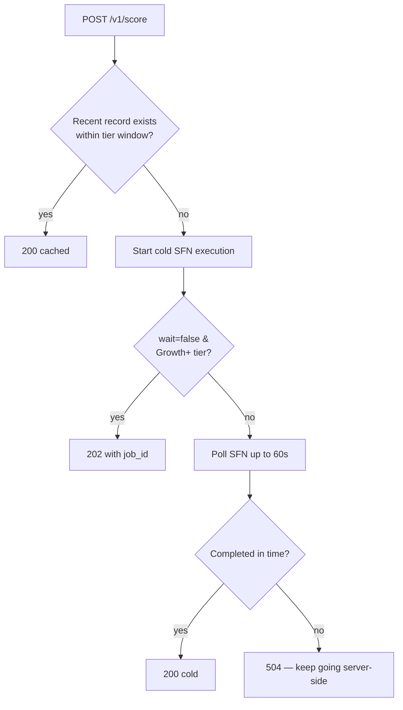

The primary scoring entry point. Returns the latest score for `domain` — either from cache (if a stored record is within your tier's freshness window) or by running a fresh cold pipeline.

## When to use it

- You want the score for a specific company **right now**.
- You don't already have a stored record, or it's stale for your purposes.
- You're on Free / Starter — sync is the only path available.

If you have a `job_id` from an earlier async start, use [`GET /v1/jobs/{job_id}`](/endpoints/jobs) instead.

## Behavior



## Example (Python)

```python
import requests

r = requests.post(
    "https://api.keplerinsights.us/v1/score",
    headers={"X-API-Key": "ki_live_..."},
    json={"domain": "stripe.com"},
    timeout=70,  # >60s cold budget + headroom
)
score = r.json()
print(f"{score['domain']}: {score['ki_rating']} ({score['composite_score']:.1f})")
```

## Example (curl, with async fallback)

```bash
# Async on Growth+
curl -X POST https://api.keplerinsights.us/v1/score?wait=false \
  -H "X-API-Key: ki_live_..." \
  -H "Content-Type: application/json" \
  -d '{"domain": "stripe.com"}'

# → 202 { "job_id": "...", "status": "pending", "poll_url": "/v1/jobs/..." }
```

## Field notes

- **`composite_score`** is 0–100, **not 0–10.** Easy mistake when reading.
- **`scale_premium`** is a separate additive bonus (up to ~12 pts). It's already applied to `composite_score`; the field is broken out so you can show "47.0 composite + 4.1 scale premium" if you want.
- **`rank`** is computed against the full universe Kepler has ever scored, not just the active cohort. Use [`/v1/company/{domain}/cohort`](/endpoints/cohort) for sector-matched comparison.
- **`x_kepler.cache_status`** is `"cached"` or `"cold"` — use it to decide whether to surface a "last scored 4 hours ago" note in your UI.
